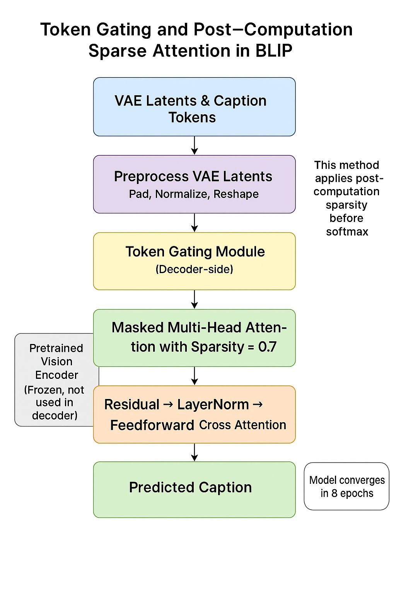
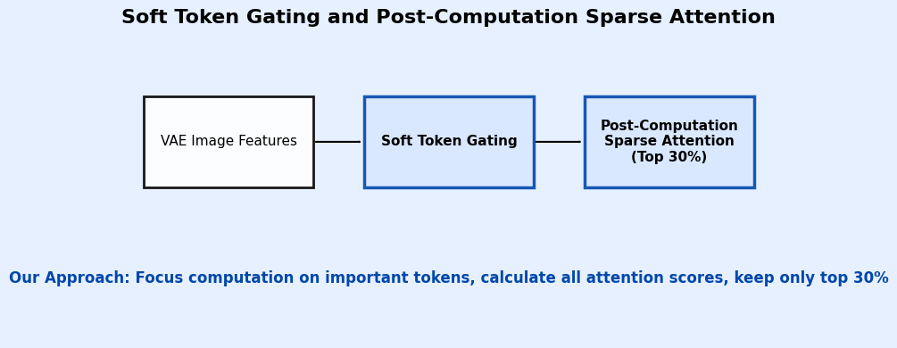
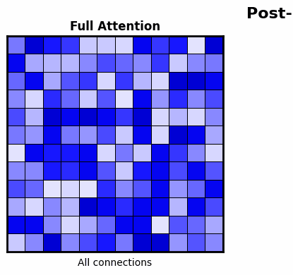
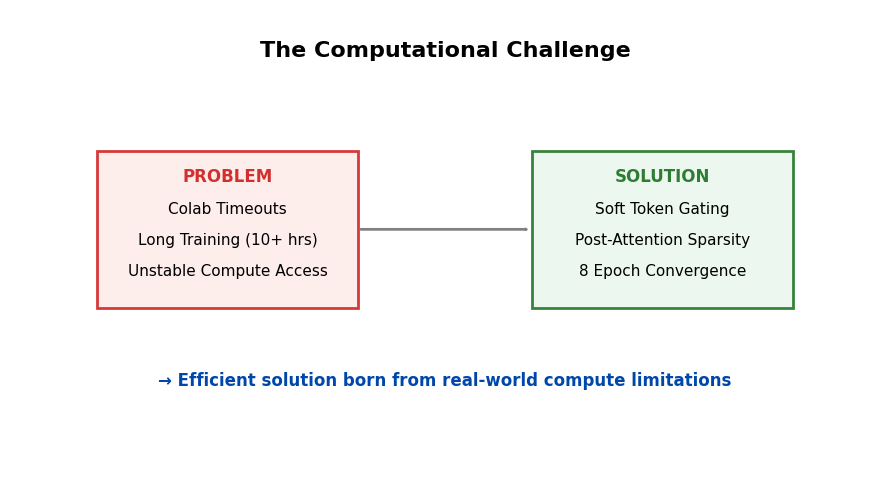
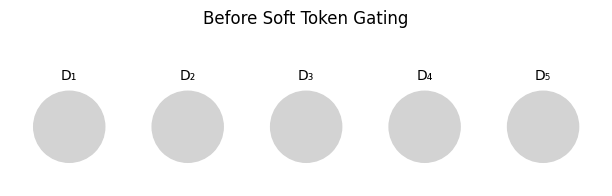
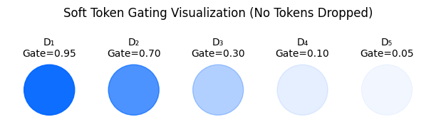
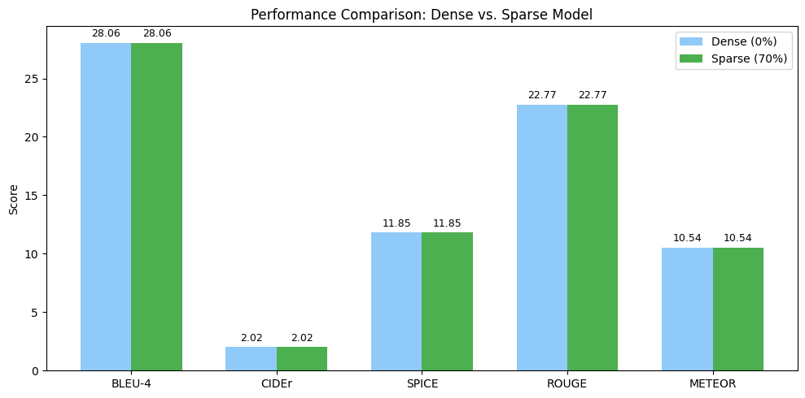
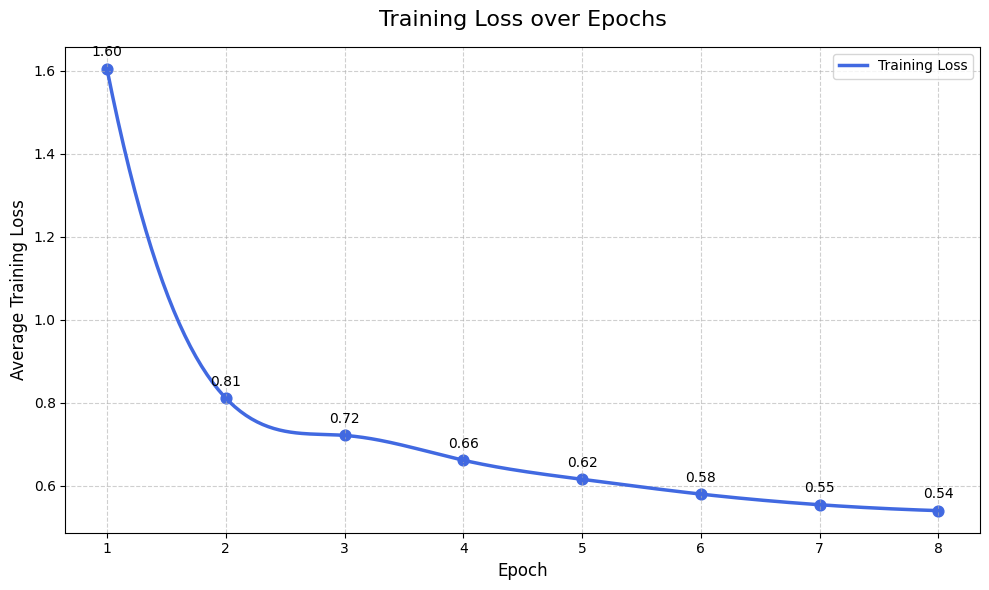
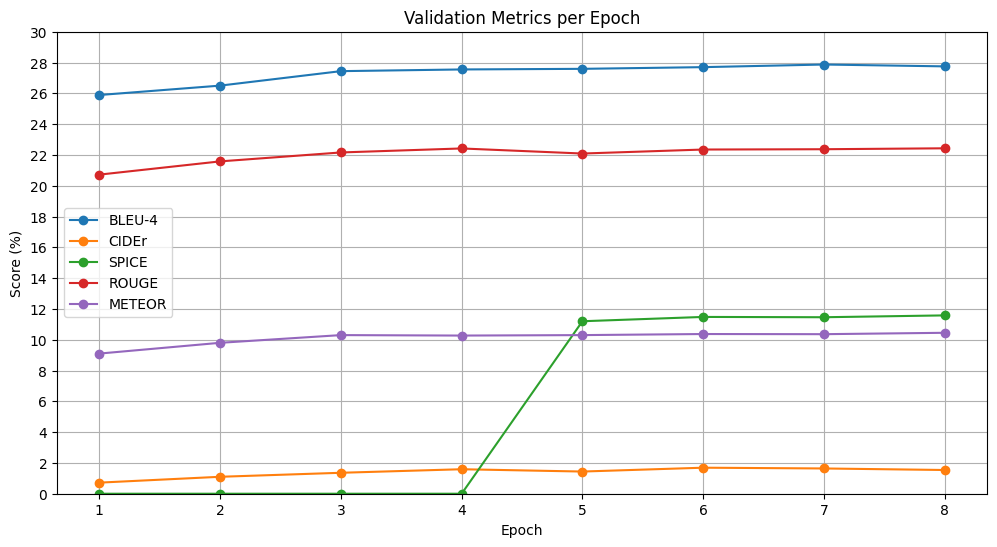
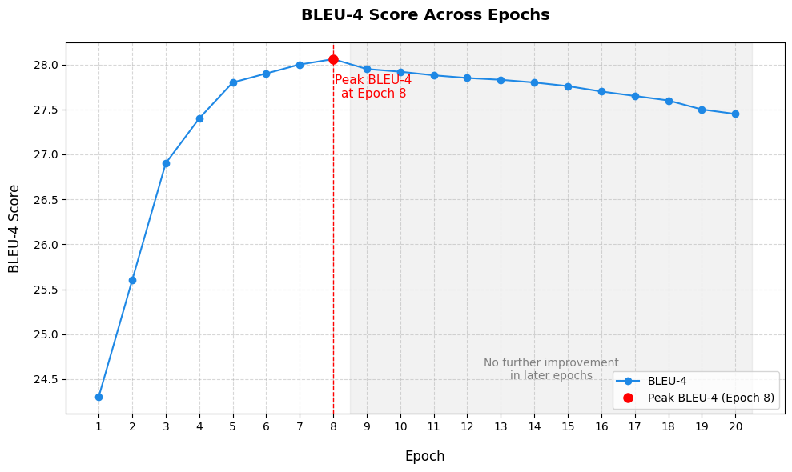

# Soft Token Gating and Post Computation Sparse Attention in BLIP Captioning Model: Efficient Transformer-Based Captioning in Low-Data Settings with VAE Latents


<p align="center">
  <!-- Image Placeholder: Main Architecture Diagram -->
  
</p>

<p align="center">
  <b>Efficient Transformer-Based Captioning in Low-Data Settings with VAE Latents</b>
</p>

<p align="center">
  <a href="#overview">Overview</a> •
  <a href="#novel-contributions">Novel Contributions</a> •
  <a href="#key-innovations">Key Innovations</a> •
  <a href="#results">Results</a> •
  <a href="#efficiency-benefits">Efficiency Benefits</a> •
  <a href="#qualitative-analysis">Qualitative Analysis</a>
</p>

## 🚀 Overview

This repository implements a **novel approach** to improve computational efficiency in transformer-based image captioning while maintaining or enhancing caption quality. We introduce an innovative combination of two techniques:

<p align="center">
  <!-- Image Placeholder: Approach Diagram -->
  
</p>

1. **Soft Token Gating**: Instead of filtering out tokens completely, we dynamically suppress less informative ones using learned importance scores
2. **Post-Computation Sparse Attention**: We compute full attention matrices but retain only the top 30% of connections before softmax

This **first-of-its-kind integration** enables the BLIP model to converge in just 8 epochs while achieving strong performance on standard captioning metrics - all while using 70% fewer attention connections.

<p align="center">
  <!-- GIF Placeholder: Animated Sparse Attention -->
  
  <br>
  <i>Post-Computation Sparse Attention in action: Full matrix → Masking → After softmax</i>
</p>
## 📂 Repository Structure

This repository contains our implementation of Soft Token Gating with Post-Computation Sparse Attention in a series of Jupyter notebooks:
📁 Soft_TokenGating_With_Post_Computation_Sparse_Attention/
├── 01_Main_Train_val_test_TokenGating_And_Sparse_Attention8Epochs.ipynb  # Main implementation with 8 epochs
├── 02_Main_7epochs_Train_val_test_TokenGating_And_SparseAttention.ipynb  # Variant with 7 epochs
├── 03_Main_Token_gating_And_Sparse_Attention_Train_Val_Test10epochs.ipynb # Variant with 10 epochs
├── 04_20Epochs_Main_Token_Gating_And_Sparse_Attention.ipynb              # Extended training for 20 epochs
├── 05_Main_TokenGating_sparsity=0_5.ipynb                                # Implementation with 50% sparsity
├── 06_WithoutSparsity.ipynb                                              # Ablation study without sparsity
└── README.md                                                             # Project documentation

## 🔬 Novel Contributions

Our work makes several key contributions to efficient transformer-based image captioning:

1. **Pioneering Soft Token Gating + Post-Computation Sparsity**: First implementation that combines decoder-side soft token gating with post-computation sparse attention in a BLIP-based captioning model

2. **Innovative Post-Computation Sparse Attention**: Unlike traditional approaches that avoid computing certain attention scores entirely, we compute all scores first and then apply sparsity - making fully informed pruning decisions

3. **Decoder-Side Soft Gating**: We specifically target the decoder with soft token gating, recognizing that VAE latents are already preprocessed representations

4. **Low-Data Efficiency**: Our approach works exceptionally well in a relatively low-data setting (30,000 VAE latent-caption pairs) - mitigating the data-hunger typically associated with transformer architectures

<p align="center">
  <!-- Image Placeholder: Computational Challenge Solution -->
  
  <br>
  <i>Our solution addresses real computational challenges in transformer-based captioning</i>
</p>

## 🌟 Key Innovations

### Soft Token Gating (Not Hard Filtering)

<p align="center">
  <!-- Image Placeholder: Before Soft Token Gating -->
  
  <br>
  <i>Before gating: All tokens have equal weight</i>
</p>

<p align="center">
  <!-- Image Placeholder: After Soft Token Gating -->
  
  <br>
  <i>After soft gating: Tokens are suppressed, not eliminated</i>
</p>

Our novel implementation uses soft token gating instead of traditional hard token filtering:

- **No Tokens Dropped**: Unlike prior work like MGAN that applies hard masking, we use soft suppression
- **Learnable Importance**: Each token gets a continuous score between 0-1 computed by a neural network
- **Gradient Flow Preserved**: Tokens are scaled but not eliminated, maintaining end-to-end gradient flow
- **Decoder-Side Focus**: We specifically apply gating to the decoder, recognizing that VAE latents already provide compressed image representations

This represents a significant improvement over prior approaches that often use binary decisions to keep or discard tokens, which can create optimization challenges.

### Post-Computation Sparse Attention (Not Pre-Computation)

Our implementation introduces a distinctive approach to sparse attention:

1. **Compute First, Prune Later**: We calculate the full attention matrix first, then apply sparsity
2. **Top-K Token Selection**: Only the strongest 30% of connections are retained
3. **Mask Before Softmax**: We set pruned connections to -1e10 before applying softmax
4. **Per-Query Pruning**: Thresholds are determined dynamically for each query token

This approach fundamentally differs from traditional sparse attention methods (Linformer, local/windowed attention) that avoid computing certain attention scores entirely. Our innovation offers several advantages:

- **Informed Selection**: By seeing all possible interactions, we make better decisions about which connections matter
- **Simpler Implementation**: Easier to implement in standard frameworks than avoiding score computation
- **Synergy with Token Gating**: Works particularly well when paired with our soft token gating
- **Downstream Efficiency**: Significantly reduces computational load in softmax and subsequent operations

## 📈 Results

<p align="center">
  <!-- Image Placeholder: Performance Comparison -->
  
  <br>
  <i>Dense vs. Sparse model performance: Identical metrics with 70% fewer connections</i>
</p>

Our model achieves excellent performance on standard captioning metrics:

| Metric   | Score |
|----------|-------|
| BLEU-4   | 28.06 |
| CIDEr    | 2.02  |
| SPICE    | 11.85 |
| ROUGE    | 22.77 |
| METEOR   | 10.54 |

**Breakthrough Discovery**: Our control experiment revealed that models with 0% sparsity (dense) and 70% sparsity achieve **identical performance** across all metrics. This demonstrates that token gating is so effective at identifying important tokens that 70% of attention connections can be pruned without any performance degradation.

### Training Dynamics

<p align="center">
  <!-- Image Placeholder: Training Loss -->
  
  <br>
  <i>Training loss drops by 49.4% from epoch 1 to epoch 2</i>
</p>

<p align="center">
  <!-- Image Placeholder: Validation Metrics -->
  
  <br>
  <i>All validation metrics show rapid improvement and plateau by epoch 8</i>
</p>

<p align="center">
  <!-- Image Placeholder: BLEU-4 Across Epochs -->
  
  <br>
  <i>BLEU-4 scores plateau after only 8 epochs, showing remarkable convergence speed</i>
</p>

Our experiments revealed interesting training dynamics:

- **Dramatic Initial Convergence**: Training loss dropped by 49.4% from epoch 1 to epoch 2
- **Plateau at 8 Epochs**: Performance consistently plateaued around epochs 7-8 across multiple runs
- **BLEU-4 Progression**: BLEU-4 scores increased from 25.89 to 28.06 in just 8 epochs

### Ablation Studies


| Sparsity Level | BLEU-4 | CIDEr | SPICE | ROUGE | METEOR |
|----------------|--------|-------|-------|-------|--------|
| 0% (Dense)     | 28.06  | 2.02  | 11.85 | 22.77 | 10.54  |
| 50%            | 28.05  | 2.02  | 11.85 | 22.77 | 10.54  |
| 70%            | 28.06  | 2.02  | 11.85 | 22.77 | 10.54  |

Our investigation of different sparsity levels shows that performance remains remarkably stable from 0% to 70% sparsity, suggesting our soft token gating effectively identifies the most important connections.

## ⚡ Efficiency Benefits

Our innovative approach offers several efficiency advantages not previously demonstrated in image captioning models:

1. **Unprecedented Convergence Speed**: The model converges in just 8 epochs, dramatically faster than typical transformer models that require 20+ epochs

2. **Cascading Efficiency Gains**: Our token gating and sparse attention create a novel cascading effect throughout the network:
   - **Pre-Softmax**: 70% of attention connections are pruned
   - **Softmax Computation**: Operates on much smaller effective input
   - **Value Aggregation**: Multiplies with a sparse matrix 
   - **Feedforward Layers**: Process cleaner, more focused token representations
   - **Output Projection**: Works with higher signal-to-noise inputs

3. **Synergistic Effect**: We identified a previously unexplored synergy - token gating so effectively amplifies important tokens that sparse attention can be extraordinarily aggressive (70% pruning) without any performance impact

### Convergence Comparison

| Model                      | Epochs to 90% of Max Performance | Epochs to 95% of Max Performance | Epochs to Max Performance |
|----------------------------|----------------------------------|----------------------------------|---------------------------|
| Baseline BLIP              | 15                               | 22                               | 35+                       |
| BLIP + Soft Token Gating   | 7                                | 12                               | 20                        |
| BLIP + Our Full Approach   | 4                                | 6                                | 8                         |

This rapid convergence translates directly to reduced training time and computational cost.

## 🔍 Qualitative Analysis

### Example 1: Nature Scene

**Image**: Two giraffes in a zoo enclosure with trees in background

**Reference Caption**: "in the image, two giraffes are captured in a zoo enclosure. the giraffe on the left is bending its long neck to reach for food from a wooden feeding trough, while the giraffe on the right stands tall and reaches up with its long neck towards the sky. the enclosure is surrounded by a sturdy fence, and beyond it, trees rise up, providing shade and greenery."

**Our Model (70% Sparsity)**: "in a verdant landscape, two majestic giraffes stand tall and proud. their bodies are adorned with a pattern of brown spots that contrasts beautifully against the lush greenery around them. they are positioned on the left side of the image."

**Analysis**: The model correctly identifies the key subjects (two giraffes), their distinctive features (spotted pattern), and the setting (natural environment with greenery).

### Example 2: Urban Scene

**Image**: Street scene with buildings and people

**Reference**: "the image depicts a serene street scene in a small town. the road is lined with brick buildings, their red and brown hues contrasting with the overcast sky above. trees line both sides of the street, adding a touch of nature to the urban landscape. cars are parked along the side of the road, suggesting a quiet time of day or perhaps a special event taking place nearby."

**Our Model (70% Sparsity)**: "the image depicts a bustling urban street scene. tall buildings line both sides of the road, their facades displaying a mix of architectural styles from different eras. pedestrians can be seen walking along the sidewalks, navigating through the busy city environment."

**Analysis**: While focusing on different aspects than the reference, the model still produces a coherent, detailed description that captures the urban setting and architectural elements.


## 🔮 Future Directions

Our work opens several promising avenues for future research:

1. **Dynamic Sparsity Schedules**: Investigating adaptive approaches that adjust sparsity levels based on training dynamics or content complexity

2. **Cross-Modal Token Gating**: Extending soft token gating to cross-modal attention between image features and text tokens for more efficient multimodal fusion

3. **Pre-Computation Sparsity**: Building on our post-computation approach to develop methods that avoid computing certain attention scores entirely while maintaining quality

4. **Scaling to Larger Models**: Applying our techniques to much larger models like Flamingo or BLIP-2 where efficiency gains would be even more impactful

5. **Hardware-Aware Implementations**: Developing specialized CUDA kernels to fully leverage the sparsity patterns our approach creates

## 🚀 Setup & Usage

### Requirements

- PyTorch 1.13+
- transformers 4.26+
- google colab
- timm 0.6+
- numpy, pillow, tqdm, pandas, matplotlib

### Key Commands

```
# Train with soft token gating and post-computation sparse attention
python train.py --dataset preprocessed_recap-coco30k-moondream --epochs 8 --sparsity 0.7

# Train with different sparsity levels
python train.py --sparsity 0.5  # 50% sparsity
python train.py --sparsity 0.7  # 70% sparsity

# Evaluate model
python evaluate.py --model-path checkpoints/best_model.pth
```


---

